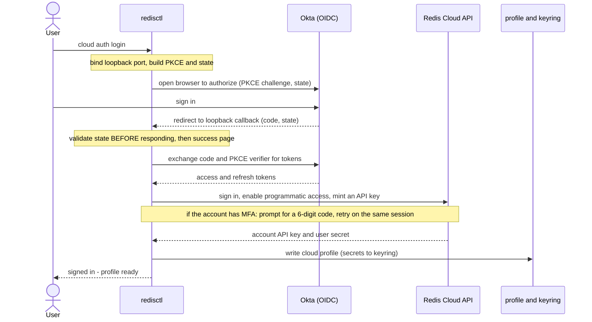
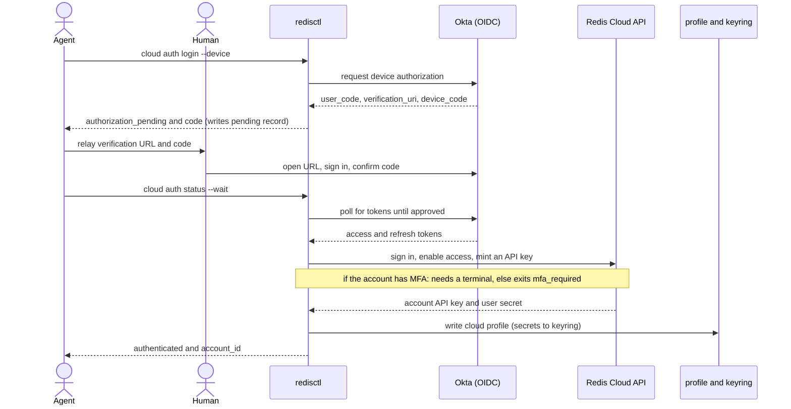

# Authentication Commands

Sign in to Redis Cloud and manage the stored session.

`cloud auth login` is a credential **bootstrapper**: it runs a standard OIDC sign-in, mints a
Redis Cloud API key for your account, and writes it into a normal profile — so you never have to
create and paste an API key by hand. Afterward every other `cloud` command works with that profile.

!!! note "Prerequisite"
    The profile needs its login endpoints — a `[cloud_auth.<profile>]` section, or the built-in
    production defaults. See [Configuration](#configuration) below.

## Log In

```bash
redisctl cloud auth login
```

Opens your browser to sign in (the interactive default), then stores the minted API key in the
profile's secure storage.

### Examples

```bash
# Interactive browser sign-in for the default cloud profile
redisctl cloud auth login

# A specific profile
redisctl cloud auth login --profile qa

# Headless machine with no local browser — use the device flow
redisctl cloud auth login --device

# Store credentials in the config file when no OS keyring is available
redisctl cloud auth login --allow-plaintext
```

| Flag | Description |
|------|-------------|
| `--device` | Use the device-authorization flow (print a URL + code) instead of opening a browser. |
| `--wait` | With `--device`: block until approved (one-shot). Without it, `login --device` returns immediately and `auth status --wait` completes the login. |
| `--allow-plaintext` | Store credentials in the config file when no OS keyring is available. |
| `--account <ID>` | Mint the key for this Redis Cloud account id. Defaults to your current account. Carried through the device flow, so `login --device --account <id>` still applies when `auth status --wait` completes it. |

### Browser (loopback) flow

The default on an interactive terminal — a single command opens the browser and completes:



### Device flow (headless / agents)

With `--device`, `login` is **non-blocking**: it prints the verification URL + code and returns, so
an agent can relay them; `auth status --wait` then completes the login. `login --device --wait`
collapses both into one blocking call for a human.



### Multi-factor authentication

If your Redis Cloud account has MFA enabled, `login` prompts for the 6-digit code from your
authenticator app after you sign in, then completes normally:

```
✓ Authenticated as user@example.com
This account requires multi-factor authentication.
Enter the 6-digit code from your authenticator app:
```

You get three attempts per login.

!!! note "MFA needs an interactive terminal"
    A time-based code can't be supplied ahead of time, so MFA can't be completed
    non-interactively. Piped or agent-driven runs exit `2` with `mfa_required`; re-run
    `redisctl cloud auth login` in a terminal. For unattended automation, use a
    pre-created API key instead of `auth login`.

### Which account the key belongs to

A Redis Cloud API key is scoped to **one account**. If you belong to several, `cloud auth login`
mints the key for your **current** account — the one selected in the
[Redis Cloud console](https://app.redislabs.com) — then names it and lists the alternatives, so you
never have to look an account id up:

```
✓ Signed in as user@example.com. Credentials saved to profile 'cloud'.
  note: the key is for Acme (#316941) — 1 of 3 accounts you belong to:
    Acme (#316941) · Contoso (#481022) · Initech (#502113)
  To use another: redisctl cloud auth login --profile <name> --account <id>
```

Use `--account` to pick one explicitly, without touching the console:

```bash
redisctl cloud auth login --account 316941
```

Naming an account you don't belong to exits `2` with `unknown_account`, and the message lists the
ones you do have. Keeping one profile per account works well:

```bash
redisctl --profile acme    cloud auth login --account 316941
redisctl --profile contoso cloud auth login --account 481022
```

Re-using one profile is fine too, but each login replaces that profile's key, so only the most
recent account stays usable.

!!! note "A new profile name defaults to production"
    A profile with no `[cloud_auth.<name>]` section falls back to the built-in **production**
    endpoints. That is what you want for production, but when logging in to a non-production
    environment, add the section first — otherwise the new profile silently signs you in to
    production instead.

`-o json` reports `account_id`, `account_name` and `account_count`, plus an `accounts` array of
every `{id, name}` — so a script can confirm it got the account it expected, or pick one without a
trip to the console.

### Password accounts need linking once

Redis Cloud accounts that sign in with an email and password cannot be used by the CLI directly —
the sign-in happens at the identity provider, which never held that password. Sign in to the
[Redis Cloud console](https://app.redislabs.com) once with **Google or GitHub using the same email
address** and accept the prompt to link the account; afterwards `cloud auth login` works normally.

Until that's done, login exits `2` with `migration_required`.

## Status

```bash
redisctl cloud auth status
```

Reports whether the profile is authenticated. With `--wait`, it completes a pending device login.

### Examples

```bash
redisctl cloud auth status

# Complete a pending `login --device`, waiting up to 5 minutes
redisctl cloud auth status --wait --timeout 300
```

| Flag | Description |
|------|-------------|
| `--wait` | Block until a pending device login is approved (or is denied / the code expires), then run the exchange and persist. |
| `--timeout <secs>` | Max seconds to wait with `--wait` (default 600). If it elapses while still pending, exits `0` reporting `authorization_pending` — run again to keep waiting. |

## Log Out

```bash
redisctl cloud auth logout
```

Removes the locally stored credentials for the profile (keyring entries and the profile), while
preserving the `[cloud_auth.<profile>]` login endpoints so you can log in again.

!!! note
    The minted API key still exists in the Redis Cloud console until you revoke it there —
    server-side revocation on logout is a planned follow-up.

## Who can use `cloud auth login`

`cloud auth login` signs in through Redis Cloud's identity provider, so it works for accounts whose
sign-in the identity provider can perform:

| Account type | Supported | Notes |
|---|---|---|
| Google | ✅ | both flows |
| GitHub | ✅ | both flows |
| SSO / SAML | ❌ | the CLI cannot select an organization's own identity provider — use an API key |
| Email + password | after linking | link the account to Google or GitHub once, in the console |
| Marketplace (Heroku, GCP, Azure) | ❌ | sign-in is initiated by the marketplace; there is no Redis-side credential |

For anything unsupported — and for **unattended automation** of any kind — create an API key in the
[Redis Cloud console](https://app.redislabs.com) and configure it directly:

```bash
redisctl profile set prod --deployment cloud --api-key "$KEY" --api-secret "$SECRET"
```

or set `REDIS_CLOUD_API_KEY` / `REDIS_CLOUD_API_SECRET` in the environment.

## Configuration

`cloud auth login` reads its OIDC endpoints from a `[cloud_auth.<profile>]` section, falling back
to built-in production defaults (so for production you usually need no section at all):

```toml
[cloud_auth.myenv]
okta_issuer    = "https://<your-okta-issuer>/oauth2/default"
okta_client_id = "<public-client-id>"
sm_api_url     = "https://<sm-api-host>/api/v1"
capi_url       = "https://api.redislabs.com/v1"
```

## Error handling (agents)

In `-o json` / `-o yaml` mode, failures on this surface print a machine-branchable envelope to
**stdout** and exit with a mapped code, so scripts and agents can branch on `.error.code` instead
of parsing prose:

```json
{ "status": "error", "error": { "code": "device_code_expired", "message": "...", "retryable": true } }
```

| Exit code | Meaning | Example codes |
|-----------|---------|---------------|
| `1` | unknown / backend failure | `sm_exchange_failed` |
| `2` | usage / precondition to fix | `not_authenticated`, `auth_denied`, `keyring_unavailable`, `migration_required`, `insufficient_permission`, `mfa_required` |
| `3` | transient / retryable | `device_code_expired`, `transient_api_error`, `rate_limited` |

Human (non-JSON) mode prints the usual diagnostic to stderr and keeps today's `0`/`1` exit behavior.
